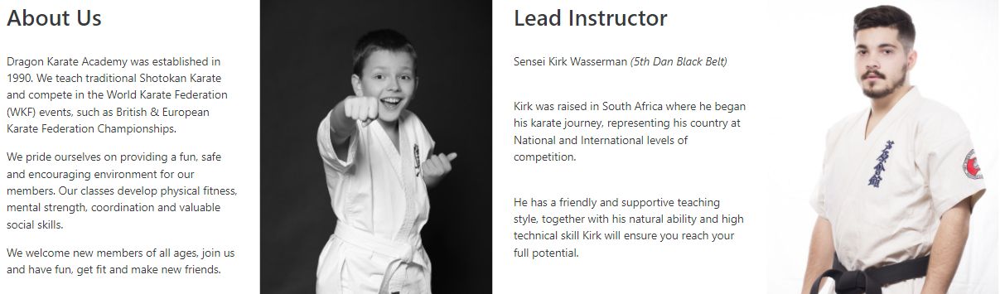

# Dragon Karate Academy

[Link to Live Website](https://simgriff.github.io/dragon-karate-academy-pp1/)

For my first project I decided to promote a fictional karate club in my local area. The aim of the website is to encourage new members to join, providing information about the club and the benefits of karate training. Information about training times is also provided for new and existing members. It is designed to be responsive and accessible on a range of devices, ensuring that it targets a wide audience. 

Images of Mobile, Tablet, Desktop skins for site here.

## User Experience (UX)
* User Stories 

  * First Time Visitor Goals
    1. As a First Time Visitor, I want to easily understand the main purpose of the site and learn more about karate and what the club can offer.
    2. As a First Time Visitor, I want to be able to easily navigate throughout the site to find content with ease.
    3. As a First Time Visitor, I want to be able to see how much membership costs and if there are any discounts available.
    4. As a First Time Visitor, I want to be able to contact the club and find the location of the club.
    5. As a first time visitor I want to know what the training times are.
    6. As a first time visitor I want to locate the clubs social media links.

  * Returning Visitor Goals

    1. As a Returning Visitor, I want to find information about training times.
    2. As a Returning Visitor, I want to find the best way to get in contact with the club with any questions I may have.
    3. As a Returning Visitor, I want to easily find contact information location and directions to the club.

  * Frequent User Goals

    1. As a Frequent User, I want to check to see if there are any newly added photos to the clubs gallery.
    2. As a Frequent User, I want to check to see if there are changes to training times.
    3. As a Frequent User, I want to be able to contact the club easily with any questions.

* Design

  * Colour Scheme
    1. The two main colours used in this project are #990000 for the top navigation bar, and #373940 for the footer with white #ffffff text. Both #990000 and #373940 were tested as background colours with #ffffff text, both passed on the contrast checker on the [Adobe Color](https://color.adobe.com/create/color-contrast-analyzer) website ensuring excellent readability. All other text on the site was #373940 on a white background, which also passed the contrast checker.

  * Typography

    1. The Roboto font from [Google Fonts](https://fonts.google.com/) is the main font used throughout the whole website with Sans Serif as the fallback font in case for any reason the font isn't being imported into the site correctly. Roboto has been used for all headings in the site.
    2. Roboto-strong clean lines, with gentle curves is a popular font that is familiar to user and was used throughout the main text in the site. Google fonts suggested Oswald as a good pairing for this font and has been designed to be used on various devices. This font was used in all headings including the logo.

* Imagery

    1. The main hero image is designed to attract new members with its inspirational image of karate training.
    2. One of the intensions of the site was to attract members of all ages, images of children practicing karate and enjoying themselves were included in the site.
    3. All images used throughout the site are from [pixabay](https://pixabay.com/) and [unsplash](https://unsplash.com/) with a Free to use license.

## Wireframes
The wireframes for the Dragon Karate Academy website were produced using Balsamiq. Please note that the original design was for only three pages, this was later modified to four pages in order to fit the content.

* Mobile Wireframes:
  - [Home](docs/wireframes/home-mobile.png)
  - [Gallery](docs/wireframes/gallery-mobile.png)
  - [Contact](docs/wireframes/contact-mobile.png)

* Desktop Wireframes:
  - [Home](docs/wireframes/home-desktop.png)
  - [Gallery](docs/wireframes/gallery-desktop.png)
  - [Contact](docs/wireframes/contact-desktop.png)

## Features

### Navigation

The navigation bar is included on all four pages of the site and includes the club's logo, Home, Gallery , Training and Contact page links. The logo also links to the home page when clicked. The current page title is highlighted in white and underlined, with the other menu items a more muted white on the deep red background, this ensures the user is always aware of their location within the site.

### Footer

The white text and icons on the dark grey backround of the footer provided continuity throughout the site. The footer has been divided into two clear sections. Basic club contact details are displayed on the left hand side, when clicked, this takes you to the main Contact Page providing the user with full contact details. The right hand side contains social media links to the Club’s Facebook, Twitter, YouTube and Instagram accounts.

### Home Page

The Home page draws the users attention with the eye catching Hero Image of karate training on the beach. This immediately conveys the subject of the site.

* *About Us Section*

Provides a brief history of the club including what service they provide and their goals, this is intended to encourage new users to join.

* *Lead Instructor Section*

Personal story of Lead Instructor to provide the user with confidence as the training is led by a very experienced sensei at the club.

* *Benefits of karate Section*

Further information on the physical and mental benefits of karate to encourage new members to take up the discipline and inspiration to existing members to stick with the training.

### Gallery page

The page presents photos from the club showing members of all ages having fun training and in competition. These images are intended to encourage potential new members to join. Existing members will also appreciate seeing themselves and fellow members enjoying themselves at the club.

### Training Page

The training table clearly displays the clubs regular training session times and age groups. There is also a section on costs providing information on club membership including discounts and a link to contact the club, this takes the user to the Contact page within the site.

### Contact page

The contact page is where new and existing members can contact the club. They are provided with multiple options to communicate with the club  including the club’s full postal address, email and telephone number together with a google map to show precisely where the club is located. Users also have the option to contact the club via a form that incorporates a dropdown subject option with room to input a typed message to the club in a box underneath. This has a clearly defined send button to submit the form.

## Future Features

* A members area with links and information about remote training sessions and private one on one sessions available. 
* A members area to allow students access the clubs online instructional videos and further information regarding upcoming events.
* Another page where members can purchase karate equipment and other merchandise.

## Technologies Used

### Languages Used

* HTML5
* CSS3

### Frameworks, Libraries & Programs Used

* [Balsamiq:](https://balsamiq.com/)
Balsamiq was used to create the wireframes during the design process.

* [Google Fonts:](https://fonts.google.com/)
Google fonts were used to import the ‘Oswald’ and ‘Roboto’' fonts into the style.css file which is used on all pages throughout the project.

* [Font Awesome:](https://fontawesome.com/)
Font Awesome was used on all pages throughout the website to add icons for aesthetic and UX purposes.

* [Google Maps:](https://www.google.com/maps)
Code for embeded google map obtined from Google Maps

* [Bootstrap 4.3:](https://getbootstrap.com/docs/4.3/getting-started/introduction/)
Bootstrap was used to assist with the responsiveness and styling of the website, it was used to structure the site and helped make the Navigation menu be responsive. In particular, Bootstrap sample code was used for the navbar, footer and form where it was customized to fit my content and purpose.

* [pixlr.com:](https://pixlr.com/e)
The PIXLR website was used to resize images and editing photos for this project.

* [Git:](https://git-scm.com/)
Git was used for version control by utilizing the Gitpod terminal to commit to Git and Push to GitHub.

* [GitHub:](https://github.com/)
Github was used to host and deploy the website.

## Testing

Throughout the project I have been using DevTools on the Chrome browser to test changes to the HTML and CSS code. I have committed regularly and included detailed messages detailing the changes made.

The W3C Markup Validator and W3C CSS Validator Services were used to validate every page of the project to ensure there were no syntax errors in the project.

### W3C Markup Validator results

 + Home Page

 + Gallery page

 

 + Training Page

 

 + Contact page

 

### W3C CSS Validator results:

No errors were returned for all HTML or CSS across all tests. 

### Lighthouse Testing
For the Lighthouse testing Best Practices only reached a score of 87, with the message 'Links to cross-origin destinations are unsafe'. 

When I read more into this I found that when you link to a page on another site using the target="_blank" attribute, you can expose your site to performance and security issues. The advice given was to add rel="noopener" to my target="_blank" links to avoids these issues. Once this was done the following results were achieved;

### Manual Testing

This website was tested on Google Chrome, Internet Explorer, Microsoft Edge and Mozilla Firefox. The site was also tested across multiple devices to ensure all links and styling worked correctly and to ensure responsiveness across the devices. All features on the page were tested to ensure functionality was intact. Testing was carried out on an Apple iPhone, Apple iPhone 13, Apple iPad Pro, Samsung Galaxy S20 FE, Samsung Galaxy A51, & Windows 10 Desktop.
Friends and family members were asked to review the site and documentation to point out any bugs and/or user experience issues.

### Fixed Bugs
During testing then Home page did not display four alternating columns of text and image as intended. I was initially unable to discover the issue, my mentor suggested that I need to check that I hadn't inadvertently overwritten my Bootstrap Grid. I discovererd that this was the case, I had overcompensated with the margins on the sections and this had resulted in there only being enough width for three columns on the page. I removed the offending margins from the custom classes I had created and this resolved the issue.

There was also an issue with the main logo, it was permanently underlined in blue along with a blue font colour instead of the intended white. Eventually I discovered the problem, a simple typo, the Bootstrap Nav Bar had been incorrectly shown as _nabar-brand_** instead of _navbar-brand_**. As tsoon as I fixed the typo, the issue was resolved.

## Deployment

### GitHub Pages

* The project was deployed to GitHub Pages using the following steps:

1.	Log in to GitHub and locate the GitHub Repository
2.	At the top of the Repository (not top of page), locate the "Settings" Button on the menu.
3.	Scroll down the Settings page until you locate the "GitHub Pages" Section.
4.	Under "Source", click the dropdown called "None" and select "Main Branch".
5.	The page will automatically refresh.
6.	Scroll back down through the page to locate the now published site link in the "GitHub Pages" section.

* Forking the GitHub Repository

By forking the GitHub Repository we make a copy of the original repository on our GitHub account to view and/or make changes without affecting the original repository by using the following steps:
1.	Log in to GitHub and locate the GitHub Repository
2.	At the top of the Repository (not top of page) just above the "Settings" Button on the menu, locate the "Fork" Button.
3.	You should now have a copy of the original repository in your GitHub account.

* Making a Local Clone

1.	Log in to GitHub and locate the GitHub Repository
2.	Under the repository name, click "Clone or download".
3.	To clone the repository using HTTPS, under "Clone with HTTPS", copy the link.
4.	Open Git Bash
5.	Change the current working directory to the location where you want the cloned directory to be made.
6.	Type git clone, and then paste the URL you copied in Step 3.

$ git clone https://github.com/SimGriff/dragon-karate-academy-pp1

7.	Press Enter. Your local clone will be created.

$ git clone https://github.com/SimGriff/dragon-karate-academy-pp1
> Cloning into `CI-Clone`...
> remote: Counting objects: 10, done.
> remote: Compressing objects: 100% (8/8), done.
> remove: Total 10 (delta 1), reused 10 (delta 1)
> Unpacking objects: 100% (10/10), done.
Click [Here](https://docs.github.com/en/repositories/creating-and-managing-repositories/cloning-a-repository#cloning-a-repository-to-github-desktop) to retrieve pictures for some of the buttons and more detailed explanations of the above process.

## Credits

### Code

* [Bootstrap4:](https://getbootstrap.com/docs/4.4/getting-started/introduction/)
Bootstrap Library used throughout the project mainly to make site responsive using the Bootstrap Grid System. Bootstrap snippets from the site were also used with some modification to produce responsive navigation, footer and form.

* [Google Maps:](https://www.google.com/maps)Code for embedded google map obtained from Google Maps.
Code for embedded google map obtained from Google Maps.

* Code used from Whiskey Drop Project to help with responsive Navigation menu and help with the submit form in the Contact page.

* [Duda](https://blog.duda.co/responsive-google-maps-for-your-website) site, code used to modify embeded Google Map.

* [W3Schools:](https://www.w3schools.com/)
Also used W3Schools site, utilising their Tutorials on various topics that contributed to my general understanding e.g. Bootstrap Grids, forms, navigation bar.

### Media

* Map embedded from [Google Maps.](https://www.google.com/maps).
* The wireframes were created using Balsamiq[Balsamiq.](https://balsamiq.com/)
* The font came from [Google Fonts.](https://fonts.google.com/)
* The icons came from [Font Awesome.](https://fontawesome.com/)
* Images are from [Unsplash.com](https://unsplash.com/) and [Pexels.com.](https://www.pexels.com/)
 - Individual Credits
  + Allen Tanzadeh (Unsplash)
  + Ashima Pargal (Unsplash)
  + Jonathan Borb (Unsplash)
  + Mats Sommervold (Unsplash)
  + Nathan Dumlao (Unsplash)
  + Sam Moqada (Unsplash)
  + Samuel Castro (Unsplash)
  + Soon Santos (Unsplash)
  + Thao Le Hoang (Unsplash)
  + Uriel Soberane (Unsplash)

